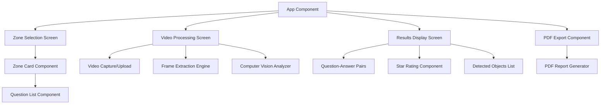
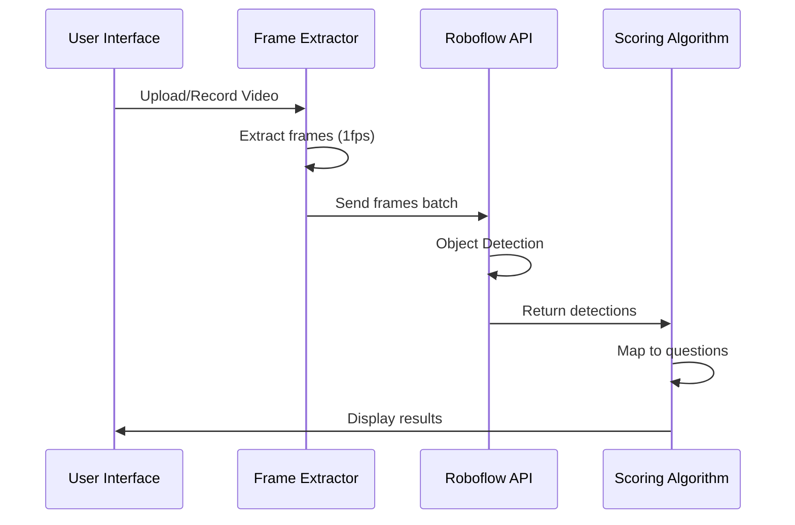
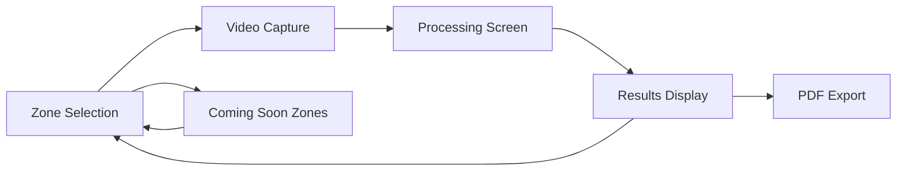
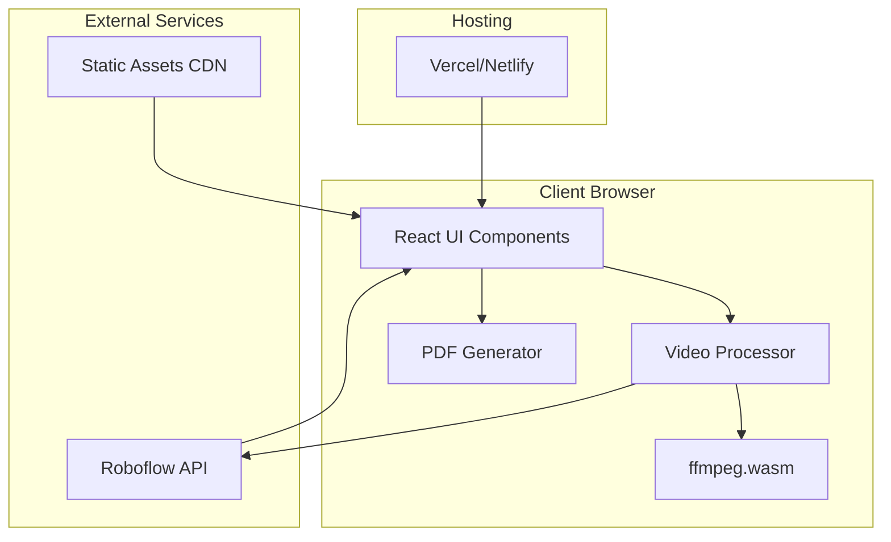
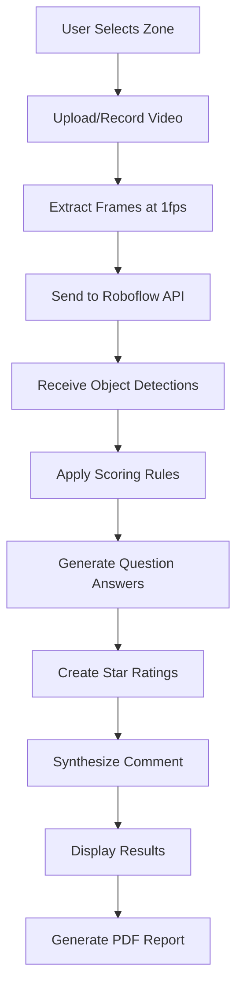
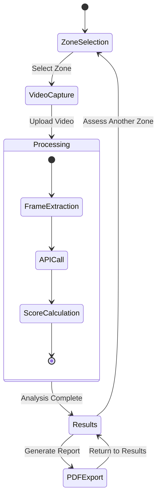

# Secret Guest MVP - Hotel Quality Assessment Application

## Overview

The Secret Guest MVP is a web-based application designed for hackathon demonstration that automates hotel quality assessment through video analysis. The application processes short video recordings from three hotel zones (Reception, Room, Bathroom) and automatically answers quality assessment questions using computer vision models, generating comprehensive PDF reports with star ratings.

**Core Value Proposition**: Transform manual hotel quality inspections into automated assessments by leveraging computer vision to answer standardized guest questionnaire items, providing instant feedback with visual evidence.

**Target Users**: Hotel quality assessors, mystery shoppers, and hospitality managers seeking efficient, standardized evaluation methods.

## Technology Stack & Dependencies

### Frontend Framework
- **React** with Vite/Next.js for rapid development and hot reloading
- **TypeScript** for type safety and better development experience
- **TailwindCSS** with ostrovok.ru color palette for consistent UI design

### Video Processing
- **ffmpeg.wasm** for client-side video processing
- Frame extraction at 1 FPS with maximum 10-15 frames per video
- Support for 15-30 second video recordings

### Computer Vision
- **Roboflow Hosted Inference API** (Free tier)
- Two specialized models:
  - General object detection (furniture, amenities, people)
  - Negative condition detection (stains, dirt, clutter)

### PDF Generation
- **jsPDF** or **pdf-lib** for client-side PDF report generation
- No server-side dependencies for document creation

### Hosting & Deployment
- **Vercel** or **Netlify** for static site hosting
- Client-side only architecture (no backend server required)
- Local storage for temporary data (no persistent storage)

## Component Architecture

### Core Components Hierarchy



### Component Definitions

#### ZoneSelector Component
**Purpose**: Main interface for selecting assessment zones
**Props**:
- `zones`: Array of zone configurations
- `onZoneSelect`: Callback for zone selection

**State**:
- `selectedZone`: Currently selected zone object
- `completedZones`: Array of completed assessments

#### VideoProcessor Component
**Purpose**: Handles video recording/upload and frame extraction
**Props**:
- `zone`: Selected zone configuration
- `onProcessingComplete`: Callback with extracted frames

**State**:
- `isRecording`: Boolean recording status
- `videoFile`: Selected/recorded video file
- `extractedFrames`: Array of base64 frame images
- `processingStatus`: Current processing stage

#### VisionAnalyzer Component
**Purpose**: Coordinates with Roboflow API for object detection
**Props**:
- `frames`: Array of frame images
- `questions`: Zone-specific questions array

**Methods**:
- `analyzeFrames()`: Sends frames to Roboflow API
- `mapDetectionsToQuestions()`: Converts API results to question answers
- `calculateStarRatings()`: Applies scoring logic

### Props/State Management

#### Global Application State
```typescript
interface AppState {
  currentZone: Zone | null;
  assessmentResults: AssessmentResult[];
  isProcessing: boolean;
  completedZones: string[];
}

interface Zone {
  id: string;
  name: string;
  questions: Question[];
  modelEndpoint: string;
}

interface Question {
  id: string;
  text: string;
  scoringCriteria: ScoringCriteria;
  detectionRules: DetectionRule[];
}

interface AssessmentResult {
  zoneId: string;
  questionAnswers: QuestionAnswer[];
  detectedObjects: DetectedObject[];
  aggregatedComment: string;
}
```

## API Integration Layer

### Roboflow Integration Architecture



### API Configuration
```typescript
interface RoboflowConfig {
  baseURL: "https://detect.roboflow.com/";
  generalModel: "hotel-objects-v1/1";
  negativeModel: "hotel-issues-v1/1";
  apiKey: string;
  confidence: 0.4;
  overlap: 0.3;
}
```

### Detection Models

#### General Objects Model
**Detected Classes**:
- People: `person`, `staff_member`, `guest`
- Furniture: `bed`, `tv`, `kettle`, `water_bottle`, `chair`, `desk`
- Amenities: `towel`, `amenities_kit`, `soap_dispenser`
- Infrastructure: `window`, `door`, `sign`, `arrow`, `reception_desk`

#### Negative Conditions Model
**Detected Classes**:
- Cleanliness Issues: `stain`, `dirt`, `hair`, `clutter`, `trash`
- Surface-Specific: `stain_on_sheet`, `hair_on_linen`, `streaked_glass`
- Location-Specific: `stain_on_sink`, `hair_in_shower`, `dirty_toilet`

## Business Logic Layer

### Zone Assessment Architecture

#### Reception Zone Assessment
**Questions & Detection Logic**:

1. **"How quickly were you checked in?"**
   - **Detection Rule**: Count `person` objects near `reception_desk`
   - **Scoring**: 1-3 people = ★★★★★, 4-6 people = ★★★☆☆, 7+ people = ★★☆☆☆

2. **"Were there clear signs and easy navigation to reception?"**
   - **Detection Rule**: Detect `sign`, `arrow`, `directional_indicator`
   - **Scoring**: 2+ signs = ★★★★★, 1 sign = ★★★☆☆, 0 signs = ★★☆☆☆

3. **"Cleanliness and order in reception area?"**
   - **Detection Rule**: Count negative objects (`trash`, `clutter`, `stain`)
   - **Scoring**: 0 issues = ★★★★★, 1-2 issues = ★★★☆☆, 3+ issues = ★★☆☆☆

#### Room Zone Assessment
**Questions & Detection Logic**:

1. **"Does the room meet expectations with basic amenities?"**
   - **Detection Rule**: Verify presence of `bed`, `tv`, `kettle`, `water_bottle`
   - **Scoring**: 4/4 items = ★★★★★, 3/4 items = ★★★★☆, 2/4 items = ★★★☆☆

2. **"Cleanliness of bedding and surfaces?"**
   - **Detection Rule**: Detect `stain_on_sheet`, `hair_on_linen`, surface dirt
   - **Scoring**: 0 issues = ★★★★★, 1 issue = ★★★☆☆, 2+ issues = ★★☆☆☆

3. **"Window cleanliness and room lighting?"**
   - **Detection Rule**: Detect `window` + absence of `streaked_glass`
   - **Scoring**: Clean windows = ★★★★★, minor streaks = ★★★☆☆, major issues = ★★☆☆☆

#### Bathroom Zone Assessment
**Questions & Detection Logic**:

1. **"Cleanliness of fixtures (sink, toilet, shower)?"**
   - **Detection Rule**: Detect `stain_on_sink`, `dirty_toilet`, `hair_in_shower`
   - **Scoring**: 0 issues = ★★★★★, 1 issue = ★★★☆☆, 2+ issues = ★★☆☆☆

2. **"Towels and toiletries provided and clean?"**
   - **Detection Rule**: Count `towel`, detect `amenities_kit`, check for stains
   - **Scoring**: Complete set + clean = ★★★★★, partial = ★★★☆☆, missing/dirty = ★★☆☆☆

### Scoring Algorithm Implementation

```typescript
interface ScoringRules {
  reception: {
    crowding: (peopleCount: number) => number;
    signage: (signCount: number) => number;
    cleanliness: (issueCount: number) => number;
  };
  room: {
    amenities: (itemsPresent: string[]) => number;
    bedding: (issueCount: number) => number;
    lighting: (hasWindow: boolean, hasIssues: boolean) => number;
  };
  bathroom: {
    fixtures: (issueCount: number) => number;
    supplies: (towelCount: number, hasAmenities: boolean) => number;
  };
}
```

### Aggregated Comment Generation

**Comment Synthesis Logic**:
```typescript
function generateAggregatedComment(results: AssessmentResult[]): string {
  const comments: string[] = [];
  
  results.forEach(result => {
    const objects = result.detectedObjects.map(obj => obj.class).join(', ');
    const issues = result.detectedObjects
      .filter(obj => obj.isNegative)
      .map(obj => obj.class).join(', ');
      
    comments.push(
      `${result.zoneName}: detected ${objects}${issues ? `, issues: ${issues}` : ''}`
    );
  });
  
  return comments.join('. ');
}
```

## User Interface Architecture

### Screen Flow Design



### Zone Selection Interface
**Layout Components**:
- Three active zone cards (Reception, Room, Bathroom)
- Placeholder cards for future zones (Restaurant, Elevator, etc.) marked "Coming Soon"
- Each active card displays associated questions
- Progress indicators for completed assessments

### Video Processing Interface
**User Experience Flow**:
1. **Capture Options**: "Record Video" or "Upload File" buttons
2. **Recording Interface**: 
   - Live camera preview
   - 15-30 second timer
   - Recording controls (start/stop)
3. **Processing Feedback**:
   - Frame extraction progress bar
   - "Analyzing with AI..." status message
   - Estimated time remaining

### Results Display Interface
**Information Architecture**:
- **Question-Answer Blocks**: Each question with detected objects and star rating
- **Visual Evidence**: Thumbnail frames showing key detections
- **Detected Objects List**: Categorized by positive/negative findings
- **Aggregated Summary**: Narrative comment section
- **Action Buttons**: "Download PDF Report", "Assess Another Zone"

## Testing Strategy

### Unit Testing Framework
**Test Coverage Areas**:
- Component rendering and prop handling
- State management and user interactions
- Video processing and frame extraction logic
- API integration with mock Roboflow responses
- Scoring algorithm accuracy with test datasets

### Component Testing Strategy
```typescript
// Example test structure
describe('VisionAnalyzer Component', () => {
  test('correctly maps object detections to question answers', () => {
    const mockDetections = [
      { class: 'person', confidence: 0.85, count: 3 },
      { class: 'reception_desk', confidence: 0.92, count: 1 }
    ];
    const result = mapDetectionsToAnswers(mockDetections, receptionQuestions);
    expect(result.crowdingScore).toBe(5); // 3 people = 5 stars
  });
});
```

### Integration Testing
**Test Scenarios**:
- End-to-end video upload → processing → results flow
- PDF generation with sample data
- Error handling for API failures
- Cross-browser compatibility (Chrome, Safari, Firefox)

### Performance Testing
**Optimization Targets**:
- Frame extraction: < 5 seconds for 30-second video
- API response time: < 10 seconds for batch processing
- PDF generation: < 3 seconds for standard report
- Total assessment cycle: < 30 seconds

## Mermaid Diagrams

### System Architecture Overview


### Data Flow Architecture


### Component State Management
