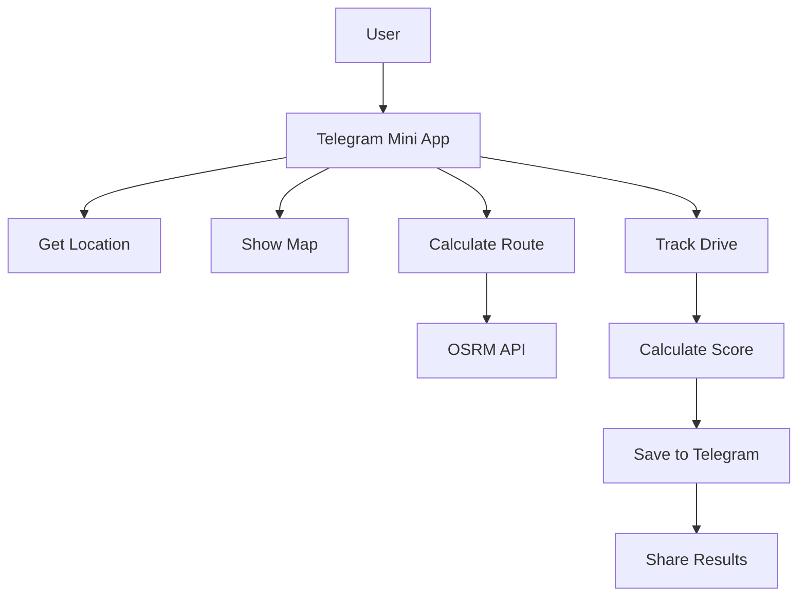
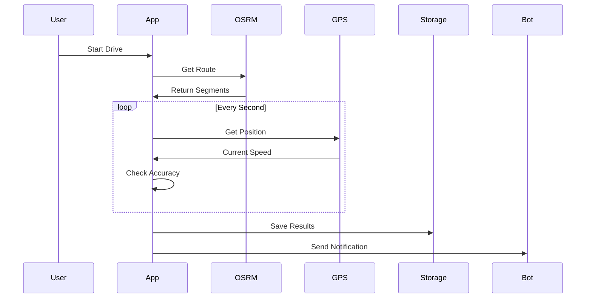

# Mobile Racing Navigation App Design Document

## Overview

### Project Vision
A mobile navigation application that transforms every drive into a competitive rally-style experience while maintaining strict adherence to traffic rules. The app gamifies navigation by challenging drivers to maintain optimal speeds on each route segment, creating a social competitive environment through leaderboards.

### Core Value Proposition
- **Gamified Navigation**: Transform regular driving into an engaging rally-style competition
- **Legal Compliance**: Encourage adherence to speed limits rather than violation
- **Social Competition**: Community-driven leaderboards across different distance categories
- **Precision Driving**: Reward accuracy and consistency in speed management

### Target Platform
- **Platform**: Telegram Mini App (exclusively)
- **Deployment**: Telegram WebApp hosted on GitHub Pages or Vercel
- **Integration**: Deep integration with Telegram's native features

## Technology Stack & Dependencies

## Technology Stack & Dependencies

### Core Technologies (Minimal Setup)
- **Platform**: Telegram Mini App only
- **Frontend**: Pure HTML5 + Vanilla JavaScript + CSS3
- **Maps**: Leaflet.js (lightweight, 39KB)
- **Data Storage**: Telegram Cloud Storage + localStorage fallback
- **Routing**: OSRM public API (free, no registration)
- **Hosting**: GitHub Pages (free, zero configuration)

### No External Dependencies
- No React/Vue/Angular (keep it simple)
- No state management libraries (use simple objects)
- No UI frameworks (use Telegram native styling)
- No build tools (direct file serving)
- No external databases (Telegram Cloud Storage only)

## Architecture

### Simple System Architecture



### Data Flow (Simplified)



## Component Architecture

## Component Architecture

### Simple File Structure
```
telegram-racing-app/
├── index.html          # Main app page
├── style.css           # Simple styling
├── app.js              # Main application logic
├── map.js              # Map and routing logic
├── drive.js            # Drive tracking logic
├── storage.js          # Data storage helpers
└── utils.js            # Helper functions
```

### Core Functions (Single Responsibility)

```javascript
// app.js - Main application
class RacingApp {
  constructor() {
    this.currentRoute = null;
    this.isDriving = false;
    this.driveData = null;
  }
  
  async init() {
    await this.setupTelegram();
    this.setupUI();
    this.setupMap();
  }
  
  startDrive(route) { /* Simple drive start */ }
  stopDrive() { /* Simple drive stop */ }
  showResults(results) { /* Simple results display */ }
}

// map.js - Map functionality
class MapManager {
  constructor(containerId) {
    this.map = L.map(containerId);
    this.route = null;
  }
  
  async calculateRoute(start, end) { /* OSRM call */ }
  showRoute(route) { /* Display on map */ }
  clearRoute() { /* Remove from map */ }
}

// drive.js - Drive tracking
class DriveTracker {
  constructor() {
    this.segments = [];
    this.currentSegment = 0;
    this.accuracy = 0;
  }
  
  startTracking(route) { /* Begin GPS tracking */ }
  updatePosition(position) { /* Process GPS update */ }
  calculateAccuracy(speed, limit) { /* Simple calculation */ }
  finishDrive() { /* Calculate final score */ }
}

// storage.js - Data management
class DataStorage {
  static async save(key, data) { /* Telegram Cloud Storage */ }
  static async load(key) { /* Load from storage */ }
  static saveLocal(key, data) { /* localStorage fallback */ }
  static loadLocal(key) { /* localStorage fallback */ }
}
```

## Routing & Navigation

## Routing & Navigation

### Simple Route Planning

```javascript
// Simple route calculation
async function calculateRoute(startLat, startLng, endLat, endLng) {
  const url = `https://router.project-osrm.org/route/v1/driving/${startLng},${startLat};${endLng},${endLat}?steps=true`;
  
  try {
    const response = await fetch(url);
    const data = await response.json();
    return processRoute(data.routes[0]);
  } catch (error) {
    console.error('Route calculation failed:', error);
    return null;
  }
}

// Convert OSRM response to simple segments
function processRoute(osrmRoute) {
  const segments = osrmRoute.legs[0].steps.map((step, index) => ({
    id: index,
    distance: Math.round(step.distance),
    duration: Math.round(step.duration),
    instruction: step.maneuver.instruction || `Continue ${Math.round(step.distance)}m`,
    speedLimit: getDefaultSpeedLimit(step.distance), // Simple default logic
    coordinates: step.geometry
  }));
  
  return {
    segments,
    totalDistance: Math.round(osrmRoute.distance),
    totalDuration: Math.round(osrmRoute.duration)
  };
}

// Simple speed limit logic
function getDefaultSpeedLimit(distance) {
  return distance > 1000 ? 90 : 60; // Highway vs city simple rule
}
```

## State Management

## State Management

### Simple Global State (No Framework)

```javascript
// app-state.js - Single source of truth
const AppState = {
  // User from Telegram
  user: null,
  
  // Current route
  route: null,
  
  // Drive tracking
  drive: {
    active: false,
    startTime: null,
    currentSegment: 0,
    segments: [],
    totalAccuracy: 0
  },
  
  // Settings
  settings: {
    sound: true,
    haptic: true
  }
};

// Simple state updates
function updateState(path, value) {
  const keys = path.split('.');
  let current = AppState;
  
  for (let i = 0; i < keys.length - 1; i++) {
    current = current[keys[i]];
  }
  
  current[keys[keys.length - 1]] = value;
  saveStateToTelegram();
}

// Auto-save important data
async function saveStateToTelegram() {
  try {
    await Telegram.WebApp.CloudStorage.setItem('app_state', JSON.stringify({
      drive: AppState.drive,
      settings: AppState.settings
    }));
  } catch (error) {
    // Fallback to localStorage
    localStorage.setItem('app_state', JSON.stringify(AppState));
  }
}

// Load state on app start
async function loadState() {
  try {
    const data = await Telegram.WebApp.CloudStorage.getItem('app_state');
    if (data) {
      const saved = JSON.parse(data);
      Object.assign(AppState, saved);
    }
  } catch (error) {
    // Fallback to localStorage
    const data = localStorage.getItem('app_state');
    if (data) {
      Object.assign(AppState, JSON.parse(data));
    }
  }
}
```

## API Integration Layer

## API Integration Layer

### Simple API Calls (No Abstraction Layers)

```javascript
// routing.js - Direct OSRM integration
async function getRoute(startLat, startLng, endLat, endLng) {
  const url = `https://router.project-osrm.org/route/v1/driving/${startLng},${startLat};${endLng},${endLat}?steps=true&overview=full`;
  
  const response = await fetch(url);
  const data = await response.json();
  
  if (data.routes && data.routes.length > 0) {
    return processOSRMRoute(data.routes[0]);
  }
  
  throw new Error('No route found');
}

function processOSRMRoute(route) {
  const segments = route.legs[0].steps.map((step, i) => ({
    id: i,
    distance: step.distance,
    instruction: step.maneuver.instruction,
    speedLimit: step.distance > 1000 ? 90 : 60 // Simple rule
  }));
  
  return { segments, totalDistance: route.distance };
}

// telegram.js - Direct Telegram API calls
function initTelegram() {
  return {
    user: window.Telegram.WebApp.initDataUnsafe.user,
    saveData: (key, value) => window.Telegram.WebApp.CloudStorage.setItem(key, JSON.stringify(value)),
    loadData: (key) => window.Telegram.WebApp.CloudStorage.getItem(key).then(JSON.parse),
    haptic: (type) => window.Telegram.WebApp.HapticFeedback.impactOccurred(type),
    notification: (type) => window.Telegram.WebApp.HapticFeedback.notificationOccurred(type)
  };
}

// leaderboard.js - Simple GitHub JSON storage
const LEADERBOARD_URL = 'https://raw.githubusercontent.com/your-repo/leaderboards/main/scores.json';

async function getLeaderboard() {
  try {
    const response = await fetch(LEADERBOARD_URL);
    return await response.json();
  } catch (error) {
    return []; // Return empty array if fails
  }
}

async function updateLeaderboard(newScore) {
  // Send to simple webhook that updates GitHub file
  fetch('https://your-webhook.com/update-scores', {
    method: 'POST',
    headers: { 'Content-Type': 'application/json' },
    body: JSON.stringify(newScore)
  }).catch(() => {
    // Fail silently - leaderboard is not critical
    console.log('Leaderboard update failed');
  });
}
```

## Data Models & Database Schema

## Data Models & Storage

### Simple Data Structures (Plain Objects)

```javascript
// Simple route object
const route = {
  id: Date.now().toString(),
  start: { lat: 55.7558, lng: 37.6176 },
  end: { lat: 55.7558, lng: 37.7176 },
  distance: 15420,
  segments: []
};

// Simple segment object
const segment = {
  id: 0,
  distance: 250,
  speedLimit: 60,
  instruction: 'Continue straight',
  accuracy: 0 // Calculated during drive
};

// Simple drive result
const driveResult = {
  id: Date.now().toString(),
  userId: telegram.user.id,
  date: new Date().toISOString(),
  distance: 15420,
  accuracy: 87.5,
  score: 2840,
  segments: [] // Array of completed segments
};

// Simple leaderboard entry
const leaderboardEntry = {
  userId: 123456,
  username: 'RacerName',
  score: 2840,
  distance: 15420,
  accuracy: 87.5,
  date: '2024-01-15'
};
```

### Storage Strategy (Keep It Simple)

```javascript
// storage.js - Simple storage wrapper
const Storage = {
  // Save to Telegram Cloud (with localStorage fallback)
  async save(key, data) {
    const value = JSON.stringify(data);
    try {
      await window.Telegram.WebApp.CloudStorage.setItem(key, value);
    } catch (error) {
      localStorage.setItem(key, value);
    }
  },
  
  // Load from Telegram Cloud (with localStorage fallback)
  async load(key) {
    try {
      const value = await window.Telegram.WebApp.CloudStorage.getItem(key);
      return value ? JSON.parse(value) : null;
    } catch (error) {
      const value = localStorage.getItem(key);
      return value ? JSON.parse(value) : null;
    }
  },
  
  // Simple local storage for temporary data
  saveLocal(key, data) {
    localStorage.setItem(key, JSON.stringify(data));
  },
  
  loadLocal(key) {
    const data = localStorage.getItem(key);
    return data ? JSON.parse(data) : null;
  }
};

// Usage examples
const STORAGE_KEYS = {
  CURRENT_ROUTE: 'current_route',
  DRIVE_HISTORY: 'drive_history',
  USER_SETTINGS: 'user_settings',
  PERSONAL_BEST: 'personal_best'
};

// Save drive result
async function saveDriveResult(result) {
  const history = await Storage.load(STORAGE_KEYS.DRIVE_HISTORY) || [];
  history.unshift(result); // Add to beginning
  history.splice(10); // Keep only last 10 drives
  await Storage.save(STORAGE_KEYS.DRIVE_HISTORY, history);
}
```

## Business Logic Layer

## Business Logic Layer

### Simple Score Calculation (Pure Functions)

```javascript
// scoring.js - Simple, testable functions
function calculateSegmentAccuracy(actualSpeed, targetSpeed, maxSpeed) {
  // Speed violation check (fail if >22 km/h over limit)
  if (maxSpeed > targetSpeed + 22) {
    return 0;
  }
  
  // Calculate accuracy as percentage
  const difference = Math.abs(actualSpeed - targetSpeed);
  const tolerance = targetSpeed * 0.2; // 20% tolerance
  
  if (difference <= tolerance) {
    return 100 - (difference / tolerance) * 20;
  } else {
    return Math.max(0, 80 - (difference - tolerance) / targetSpeed * 80);
  }
}

function calculateTotalScore(segmentAccuracies, totalDistance) {
  if (segmentAccuracies.length === 0) return 0;
  
  const avgAccuracy = segmentAccuracies.reduce((a, b) => a + b) / segmentAccuracies.length;
  const distanceBonus = Math.log10(totalDistance / 1000 + 1); // Logarithmic distance bonus
  
  return Math.round(avgAccuracy * distanceBonus);
}

function getDistanceCategory(distance) {
  if (distance < 10000) return '10km';
  if (distance < 50000) return '50km';
  if (distance < 100000) return '100km';
  return '1000km';
}

// Simple speed violation check
function checkSpeedViolation(currentSpeed, speedLimit) {
  const excess = currentSpeed - speedLimit;
  
  if (excess <= 15) return 'none';
  if (excess <= 22) return 'warning';
  return 'critical';
}
```

### Drive Tracking Logic (Simple State Machine)

```javascript
// drive-tracker.js - Simple drive tracking
class DriveTracker {
  constructor(route) {
    this.route = route;
    this.currentSegment = 0;
    this.segmentAccuracies = [];
    this.isActive = false;
    this.startTime = null;
  }
  
  start() {
    this.isActive = true;
    this.startTime = Date.now();
    this.segmentAccuracies = [];
    this.currentSegment = 0;
  }
  
  updatePosition(lat, lng, speed) {
    if (!this.isActive) return;
    
    const segment = this.route.segments[this.currentSegment];
    if (!segment) return;
    
    // Check if segment is complete (simplified distance check)
    if (this.isSegmentComplete(lat, lng, segment)) {
      this.completeSegment(speed, segment.speedLimit);
      this.currentSegment++;
    }
    
    // Check for speed violations
    const violation = checkSpeedViolation(speed, segment.speedLimit);
    this.handleSpeedViolation(violation);
  }
  
  completeSegment(averageSpeed, speedLimit) {
    const accuracy = calculateSegmentAccuracy(averageSpeed, speedLimit, averageSpeed);
    this.segmentAccuracies.push(accuracy);
    
    // Trigger haptic feedback
    if (window.Telegram?.WebApp?.HapticFeedback) {
      window.Telegram.WebApp.HapticFeedback.impactOccurred('light');
    }
  }
  
  finish() {
    this.isActive = false;
    const totalScore = calculateTotalScore(this.segmentAccuracies, this.route.distance);
    const avgAccuracy = this.segmentAccuracies.reduce((a, b) => a + b) / this.segmentAccuracies.length;
    
    return {
      score: totalScore,
      accuracy: Math.round(avgAccuracy),
      segments: this.segmentAccuracies.length,
      distance: this.route.distance,
      duration: Date.now() - this.startTime
    };
  }
  
  isSegmentComplete(lat, lng, segment) {
    // Simplified: check if we're close to segment end
    // In real implementation, use proper distance calculation
    return true; // Placeholder
  }
  
  handleSpeedViolation(violation) {
    if (violation === 'warning' && window.Telegram?.WebApp?.HapticFeedback) {
      window.Telegram.WebApp.HapticFeedback.notificationOccurred('warning');
    } else if (violation === 'critical' && window.Telegram?.WebApp?.HapticFeedback) {
      window.Telegram.WebApp.HapticFeedback.notificationOccurred('error');
    }
  }
}
```

## Audio & Feedback System

### Sound Design Specification

**Rally-style Audio Cues**:
- **Segment Start**: Short beep (200ms, 800Hz)
- **Speed Warning**: Double beep (150ms x2, 1000Hz)
- **Segment Complete**: Success chime (300ms, ascending tone)
- **Speed Violation**: Alert tone (500ms, 1200Hz)
- **Drive Complete**: Victory fanfare (2s, multi-tone)

## Audio & Feedback System

### Simple Audio Implementation

```javascript
// audio.js - Simple beep sounds using Web Audio API
class SimpleAudio {
  constructor() {
    this.context = null;
    this.enabled = true;
  }
  
  // Initialize on first user interaction
  init() {
    if (!this.context) {
      this.context = new (window.AudioContext || window.webkitAudioContext)();
    }
  }
  
  // Simple beep function
  beep(frequency = 800, duration = 200) {
    if (!this.enabled || !this.context) return;
    
    const oscillator = this.context.createOscillator();
    const gain = this.context.createGain();
    
    oscillator.connect(gain);
    gain.connect(this.context.destination);
    
    oscillator.frequency.value = frequency;
    oscillator.type = 'sine';
    
    gain.gain.setValueAtTime(0.1, this.context.currentTime);
    gain.gain.exponentialRampToValueAtTime(0.01, this.context.currentTime + duration / 1000);
    
    oscillator.start(this.context.currentTime);
    oscillator.stop(this.context.currentTime + duration / 1000);
  }
  
  // Specific sound events
  segmentStart() {
    this.beep(800, 200);
    this.haptic('light');
  }
  
  speedWarning() {
    this.beep(1000, 150);
    setTimeout(() => this.beep(1000, 150), 200);
    this.haptic('warning');
  }
  
  segmentComplete() {
    this.beep(1200, 300);
    this.haptic('medium');
  }
  
  driveComplete() {
    // Victory sequence
    [523, 587, 659, 698].forEach((freq, i) => {
      setTimeout(() => this.beep(freq, 200), i * 150);
    });
    this.haptic('heavy');
  }
  
  // Telegram haptic feedback
  haptic(type) {
    if (window.Telegram?.WebApp?.HapticFeedback) {
      if (type === 'warning' || type === 'error') {
        window.Telegram.WebApp.HapticFeedback.notificationOccurred(type);
      } else {
        window.Telegram.WebApp.HapticFeedback.impactOccurred(type);
      }
    }
  }
  
  toggle() {
    this.enabled = !this.enabled;
  }
}

// Global audio instance
const audio = new SimpleAudio();

// Initialize on first user interaction
document.addEventListener('touchstart', () => audio.init(), { once: true });
document.addEventListener('click', () => audio.init(), { once: true });
```

## Testing Strategy

## Testing Strategy

### Simple Testing Approach

**What to Test** (Focus on Critical Logic):
- Score calculation functions
- Speed violation detection
- Route processing logic
- Data storage/retrieval

**What NOT to Test** (Keep It Simple):
- External API responses (OSRM, Telegram)
- UI interactions (manual testing is sufficient)
- Complex integration scenarios

### Unit Tests (Jest)

```javascript
// tests/scoring.test.js - Test core business logic
describe('Score Calculation', () => {
  test('calculates perfect accuracy for exact speed', () => {
    const accuracy = calculateSegmentAccuracy(60, 60, 60);
    expect(accuracy).toBe(100);
  });
  
  test('returns 0 for critical speed violation', () => {
    const accuracy = calculateSegmentAccuracy(60, 85, 85); // 25 km/h over
    expect(accuracy).toBe(0);
  });
  
  test('calculates distance category correctly', () => {
    expect(getDistanceCategory(5000)).toBe('10km');
    expect(getDistanceCategory(25000)).toBe('50km');
    expect(getDistanceCategory(75000)).toBe('100km');
    expect(getDistanceCategory(500000)).toBe('1000km');
  });
});

describe('Speed Violation Detection', () => {
  test('detects no violation within limits', () => {
    expect(checkSpeedViolation(60, 60)).toBe('none');
    expect(checkSpeedViolation(65, 60)).toBe('none');
  });
  
  test('detects warning violations', () => {
    expect(checkSpeedViolation(75, 60)).toBe('warning');
    expect(checkSpeedViolation(82, 60)).toBe('warning');
  });
  
  test('detects critical violations', () => {
    expect(checkSpeedViolation(85, 60)).toBe('critical');
  });
});

// Mock Telegram API for testing
global.window = {
  Telegram: {
    WebApp: {
      initDataUnsafe: { user: { id: 123, first_name: 'Test' } },
      CloudStorage: {
        setItem: jest.fn().mockResolvedValue(),
        getItem: jest.fn().mockResolvedValue(JSON.stringify({}))
      },
      HapticFeedback: {
        impactOccurred: jest.fn(),
        notificationOccurred: jest.fn()
      }
    }
  }
};
```

### Manual Testing Checklist

**Basic Flow Testing**:
- [ ] App loads in Telegram Mini App
- [ ] Can search for destination
- [ ] Route calculation works
- [ ] Can start drive tracking
- [ ] GPS position updates correctly
- [ ] Speed violations trigger haptic feedback
- [ ] Drive completion saves results
- [ ] Leaderboard displays correctly

**Error Handling**:
- [ ] No internet connection
- [ ] GPS disabled/unavailable
- [ ] Route calculation fails
- [ ] Telegram Cloud Storage unavailable

**Performance**:
- [ ] App loads within 3 seconds
- [ ] No memory leaks during long drives
- [ ] Battery usage is reasonable


